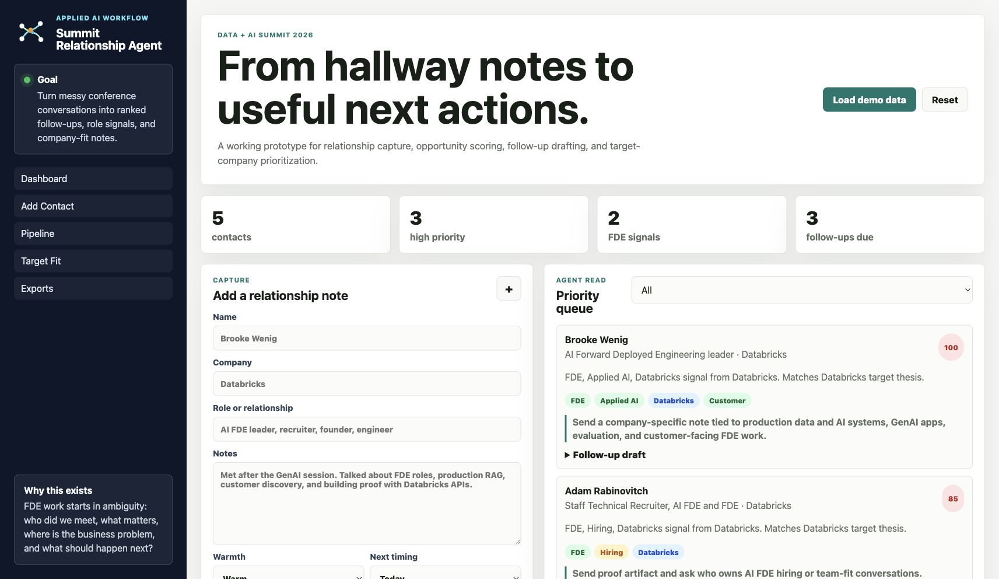

# Data + AI Summit Relationship Agent

A small applied AI workflow app for turning conference conversations into structured follow-ups, company-fit signals, and next actions.

This project is built as a proof artifact for Forward Deployed Engineering and Applied AI roles. It shows the workflow shape: start with messy human notes, extract signal, rank the opportunity, draft a follow-up, and turn relationship context into an operating surface.



## What It Does

- Captures people met at Data + AI Summit
- Detects FDE, applied AI, hiring, customer, workflow, media AI, and developer-platform signals
- Ranks contacts by priority
- Maps relationships into a follow-up pipeline
- Scores target-company fit
- Drafts concise follow-up messages
- Exports JSON, CSV, and a markdown follow-up brief
- Runs with no external dependencies

## Why This Is FDE-Shaped

Forward Deployed Engineering starts in ambiguity.

The work is rarely just code. It is:

- discovery
- workflow mapping
- technical scoping
- stakeholder translation
- prototype building
- rollout
- adoption
- feedback into product

This app is a miniature version of that loop. It turns unstructured relationship notes into a workflow a person can act on.

## Quick Start

```bash
npm run dev
```

Open:

```text
http://localhost:4173
```

Run the CLI classifier:

```bash
npm run classify
```

Run the project check:

```bash
npm run check
```

## Demo Flow

1. Click `Load demo data`.
2. Review the priority queue.
3. Open a follow-up draft.
4. Check the pipeline.
5. Copy the markdown brief.
6. Add a real contact from the Summit.

## Project Shape

```text
index.html                    Browser app
src/app.js                    Relationship classifier and UI logic
src/styles.css                Product UI
data/sample-notes.js          Browser demo data
data/sample-notes.json        CLI demo data
data/target-companies.js      Target-company fit model
scripts/classify-notes.mjs    CLI classifier
scripts/serve.mjs             Zero-dependency local server
scripts/check.mjs             Smoke check
docs/fde-product-brief.md     Product and role-positioning brief
```

## Hiring Signal

This project is intentionally small, but it is meant to show:

- applied AI product judgment
- workflow automation thinking
- customer-facing technical language
- practical prioritization
- clean UI implementation
- ability to turn a live business moment into working software

## Next Upgrades

- Add OpenAI or Anthropic API extraction for raw notes
- Add calendar/email follow-up integration
- Add LinkedIn-safe outreach templates
- Add a target-company research importer
- Add a session mode for live conference capture
- Add local file export instead of clipboard-only export

## Positioning Line

I build the bridge from messy workflow to working AI/software system.
